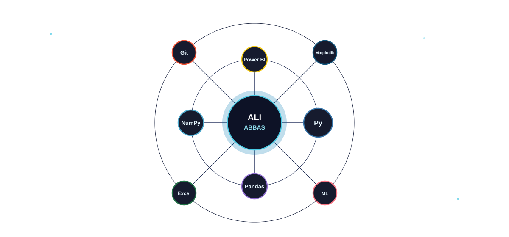
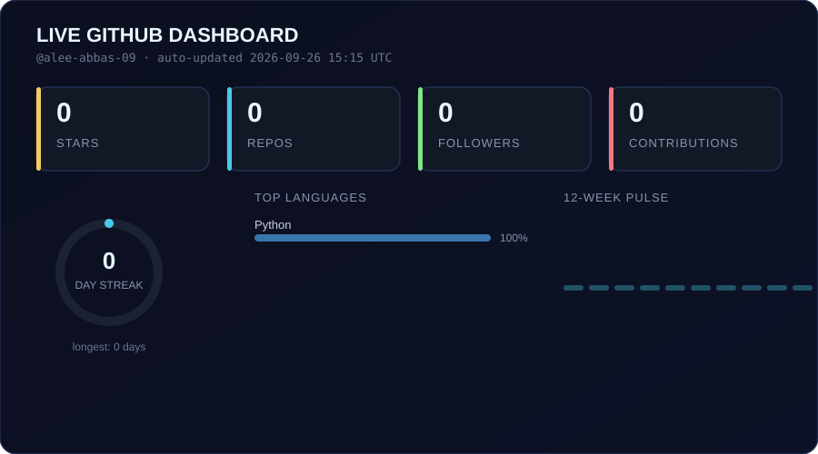

 

<table>
<tr>
<td width="55%" valign="top">

### `$ cat about.md`

🎓 **3rd Year Data Science Undergraduate**
Quaid-e-Awam University of Engineering, Science & Technology (QUEST)

📊 Passionate about **Data Science, Analytics & Visualization**
🐍 Build with **Python, Pandas & NumPy**
📈 Dashboards in **Power BI, Excel, Matplotlib & Seaborn**
🤖 Currently exploring **Machine Learning & AI**
🚀 I turn messy data into decisions people can act on

</td>
<td width="45%">

</td>
</tr>
</table>

---

### `$ ls skills/` — an orbiting stack, not a badge row

---

### `$ ./dashboard.sh --live`

⚙️ This card is <b>not a third-party badge</b> — it's generated by <code>scripts/generate_dashboard.py</code>,
which queries the GitHub API directly and renders a hand-built SVG. A workflow
(<code>.github/workflows/dashboard.yml</code>) refreshes it every 6 hours with real numbers,
so it's genuinely mine and updates itself.

---

### `$ cat focus.json`

| 📊 Data Analytics | 📈 Visualization | 🤖 Machine Learning |
|:---:|:---:|:---:|
| Data cleaning & EDA | Power BI dashboards | ML fundamentals |
| Real-world datasets | Python visualizations | Practical projects |
| Finding useful insights | Data storytelling | Exploring AI |

---

### `$ ./contribution-snake.sh`

---

### `$ contact --open-to-work`

<!-- add LinkedIn: uncomment and swap in your URL

-->

  

⚡ learning · building · shipping — one commit at a time

