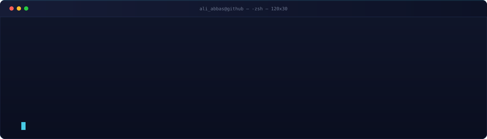
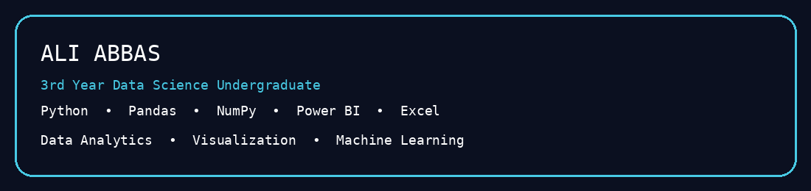

  

  

---

## 👨‍💻 About Me

🎓 **3rd Year Data Science Undergraduate** at  
**Quaid-e-Awam University of Engineering, Science & Technology (QUEST)**

📊 Interested in **Data Science, Data Analytics & Visualization**

🐍 Building projects with **Python, Pandas & NumPy**

📈 Working with **Power BI, Excel, Matplotlib & Seaborn**

🤖 Exploring **Machine Learning & AI**

🚀 Focused on turning data into meaningful insights.

 

---

## 🧰 Tech Stack

---

## 🚀 What I'm Working On

| 📊 Data Analytics | 📈 Visualization | 🤖 Machine Learning |
|:---:|:---:|:---:|
| Data cleaning & EDA | Power BI dashboards | ML fundamentals |
| Real-world datasets | Python visualizations | Practical projects |
| Finding useful insights | Data storytelling | Exploring AI |

---

## 📊 GitHub Activity

  

  

---

## 🐍 Contribution Snake

---

## 📌 Projects

⭐ Pin your best repositories on your profile to showcase them.

---

## 🎯 Currently Learning

---

## 💬 Ask Me About

`Python` `NumPy` `Pandas` `Matplotlib` `Seaborn` `Power BI` `Excel` `Data Analytics`

---

## 🤝 Let's Connect

  

### ⚡ Learning • Building • Growing

---

